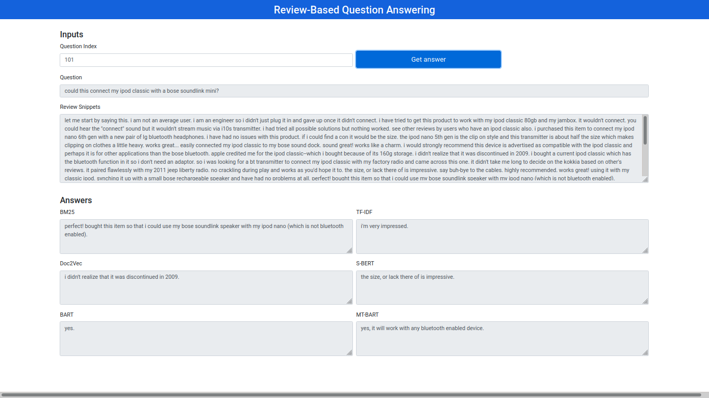
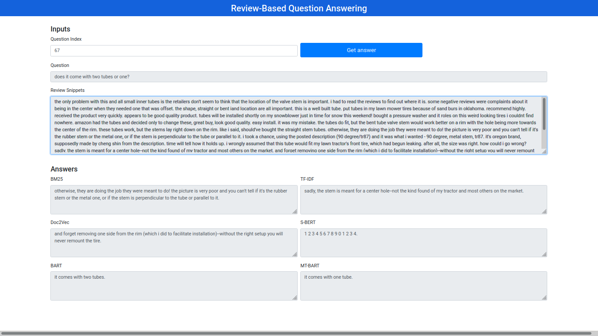

## Review-based Product Question Answering

#### Brief Intro
This repo contains the code for abstractive product question answering using BART and Multi-task BART. Subsets of the datasets provided by [Gupta et al. (2019)](https://arxiv.org/abs/1908.04364) were used to train and evaluate the models for answerability verification and answer generation. LSTM and CNN were used as baselines for answerability verification while BM25, TF-IDF, Doc2Vec and S-BERT were used as extractive baselines for answer generation. The screenshots below show multi-task bart had a superior performance by providing accurate and detailed answers to questions.

##### N.B: Work still under review for publication





#### Dependency
```
torch==1.6.0
torchtext==0.7.0
transformers==3.1.0
tokenizers==0.8.1rc2
```

#### Train LSTM for answerability verification from scratch
```
python run_answerability_verifier.py --model_type lstm --data_path /home/oluwadolapo/Datasets --train_file_name amazonQAnswerability_test.jsonl --val_file_name amazonQAnswerability_test.jsonl --test_file_name amazonQAnswerability_test.jsonl --save_model_path /home/oluwadolapo/Experiments/bertQAnswerability/rnn/model_save --save_emb_path /home/oluwadolapo/Experiments/bertQAnswerability/rnn/trained_embeddings.txt --save_voc_path /home/oluwadolapo/Experiments/bertQAnswerability/rnn/vocab.tsv --num_train_epochs 1 --train_batch_size 32 --predict_batch_size 32 --from_scratch
```

#### Resume bart training for answerability verification
```
python run_answerability_verifier.py --model_type bart --exp_type train_bart --data_path /home/oluwadolapo/Datasets/amazonQAnswerability_test.json --load_bart_path saved_models/model_save --load_classifier_path saved_models/classifier_head.pth --save_bart_path saved_models/model_save --save_classifier_path saved_models/classifier_head.pth --data_size 30000 --num_train_epochs 1 --train_batch_size 1
```

#### Test bart for answerability verification
```
python run_answerability_verifier.py --model_type bart --exp_type test_bart --data_path /home/oluwadolapo/Datasets/amazonQAnswerability_test.json --load_bart_path model_save --load_classifier_path classifier_head.pth --predict_batch_size 1
```

#### Train bart for answer generation from scratch
```
python run_answer_generator.py --exp_type train_bart --data_path /home/oluwadolapo/Datasets/amazonQA_short.json --from_scratch --save_model_path saved_models/bart_generator --data_size 30000 --num_train_epochs 1 --train_batch_size 1 
```

#### Resume bart training for answer generation
```
python run_answer_generator.py --exp_type train_bart --data_path /home/oluwadolapo/Datasets/amazonQA_short.json --load_model_path saved_models/mtbart_generator --save_model_path saved_models/bart_generator --data_size 30000 --num_train_epochs 1 --train_batch_size 1
```

#### Test bart for answer generation
```
python run_answer_generator.py --exp_type test_bart --data_path /home/oluwadolapo/Datasets/amazonQA_test.json --load_model_path saved_models/bart_generator --predict_batch_size 1 --output_json_path test.json
```

#### Train mt-bart for answerability verification and answer generation from scratch
```
python3 run_multitask_bart.py --exp_type train --generator_data_path /home/oluwadolapo/Datasets/amazonQA_short.json --verifier_data_path /home/oluwadolapo/Datasets/amazonQAnswerability_test.json --from_scratch --save_bart_path saved_models/mtbart_generator --save_classifier_path saved_models/mtbart_classifier --data_size 30000 --train_batch_size 1 --num_train_epochs 1
```

#### Resume mt-bart training for answerability verification and answer generation
```
python3 run_multitask_bart.py --exp_type train --generator_data_path /home/oluwadolapo/Datasets/amazonQA_short.json --verifier_data_path /home/oluwadolapo/Datasets/amazonQAnswerability_test.json --load_bart_path saved_models/mtbart_generator --load_classifier_path saved_models/mtbart_classifier --save_bart_path saved_models/mtbart_generator --save_classifier_path saved_models/mtbart_classifier --data_size 30000 --train_batch_size 1 --num_train_epochs 1
```

#### Test mt-bart for answerability verification
```
python3 run_multitask_bart.py --exp_type test_classifier --verifier_data_path /home/oluwadolapo/Datasets/amazonQAnswerability_test.json --load_bart_path saved_models/mtbart_generator --load_classifier_path saved_models/mtbart_classifier --predict_batch_size 1
```

#### Test mt-bart for answer generation
```
python3 run_multitask_bart.py --exp_type test_generator --generator_data_path /home/oluwadolapo/Datasets/amazonQA_short.json --load_bart_path saved_models/mtbart_generator --predict_batch_size 1 --output_json_path test.json
```

#### Running the web interface
```
python web_app.py
```
